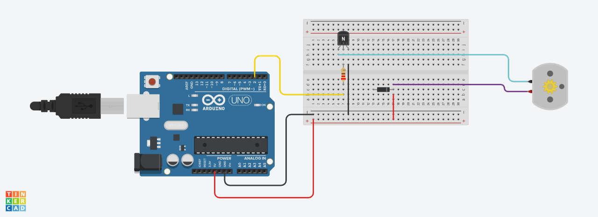
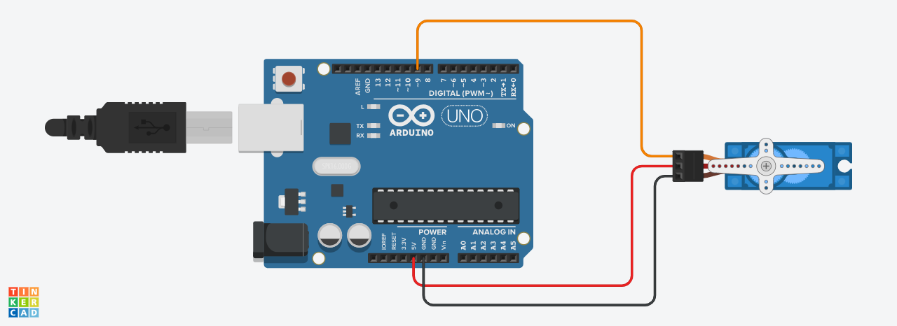

# Task2_Electronics_and_electrical_engineering

## **Description**

In this task we will use two types of motors, in the first part we will use and operate the DC motor, and in the second part we will use and operate the Micro servo.

## Part 1
### **Circuit**

In these circuit we use these components:
1. 1 Arduino board
1. 1 Breadboard 
1. 1 DC motor
1. 1 Resistor
1. 1 NPN transistor 
1. 1 Diode
1. Normal wires

## Part 2
### **Circuit**

In these circuit we use these components:
1. 1 Arduino board
1. 1 Micro servo 
1. Normal wires

